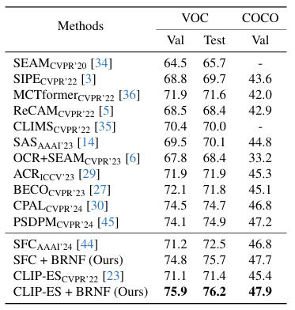

# Bias-Resilient Weakly Supervised Semantic Segmentation Using Normalizing Flows
This repository is the official implementation of "Bias-Resilient Weakly Supervised Semantic Segmentation Using Normalizing Flows".
[[paper]](xx) [[supp]](xx)

### Abstract
Weakly supervised semantic segmentation (WSSS) aims to generate dense labels using sparse annotations, such as image-level labels. Existing class activation map (CAM) generation methods have been able to locate rough objects. However, due to the limited information provided by image level labels, the bias activation problem, including over-activation, becomes another key obstacle in WSSS. To rectify such bias activation, we attempt to mine pixel level class feature distribution information from the entire dataset. Specifically, we propose to use normalizing flow to model the class feature distribution of all pixels across the entire dataset and design a Bias-Resilient WSSS framework based on Normalizing Flow (BRNF). Normalizing flow has the ability to map complex distributions to normal distributions. Building upon it, we designed an additional Gaussian mixture classifier which classifies pixels from the perspective of feature distributions, providing supplementary information to the conventional MLP based classifier. In addition, we use this distribution to sample low bias features as positive anchors for contrastive learning, thereby encouraging feature optimization toward the correct low-bias direction. Experimental results demonstrate that our method significantly outperforms existing baselines, achieving state-of-the-art performance on WSSS benchmarks.

## Setup
The full code is expected to be released by the end of November, after CVPR DDL.
## Data Preparation

### PASCAL VOC 2012

#### 1. Download

``` bash
wget http://host.robots.ox.ac.uk/pascal/VOC/voc2012/VOCtrainval_11-May-2012.tar
```
#### 2. Segmentation Labels

The augmented annotations are from [SBD dataset](http://home.bharathh.info/pubs/codes/SBD/download.html). The download link of the augmented annotations at [DropBox](https://www.dropbox.com/s/oeu149j8qtbs1x0/SegmentationClassAug.zip?dl=0). After downloading ` SegmentationClassAug.zip `, you should unzip it and move it to `VOCdevkit/VOC2012/`. 

``` bash
VOCdevkit/
└── VOC2012
    ├── Annotations
    ├── ImageSets
    ├── JPEGImages
    ├── SegmentationClass
    ├── SegmentationClassAug
    └── SegmentationObject
```

### MSCOCO 2014

#### 1. Download
``` bash
wget http://images.cocodataset.org/zips/train2014.zip
wget http://images.cocodataset.org/zips/val2014.zip
```

#### 2. Segmentation Labels

To generate VOC style segmentation labels for COCO, you could use the scripts provided at this [repo](https://github.com/alicranck/coco2voc), or just download the generated masks from [Google Drive](https://drive.google.com/file/d/147kbmwiXUnd2dW9_j8L5L0qwFYHUcP9I/view?usp=share_link).

``` bash
COCO/
├── JPEGImages
│    ├── train2014
│    └── val2014
└── SegmentationClass
     ├── train2014
     └── val2014
```
## Main Results

## Citation
- Please cite our paper if the code is helpful to your research.

```
@InProceedings{Qiu_2025_ICCV,
    author    = {Qiu, Xianglin and Wang, Xiaoyang and Zhang, Zhen and Xiao, Jimin},
    title     = {Bias-Resilient Weakly Supervised Semantic Segmentation Using Normalizing Flows},
    booktitle = {Proceedings of the IEEE/CVF International Conference on Computer Vision (ICCV)},
    month     = {October},
    year      = {2025}
}
```
## Acknowledgement
The base training codes are from [SIPE](https://github.com/chenqi1126/SIPE) and the codes about normalizing flow are from [FlowGMM](https://github.com/izmailovpavel/flowgmm) and [DDFP](https://github.com/gavinwxy/DDFP). Thanks for their excellent works.
